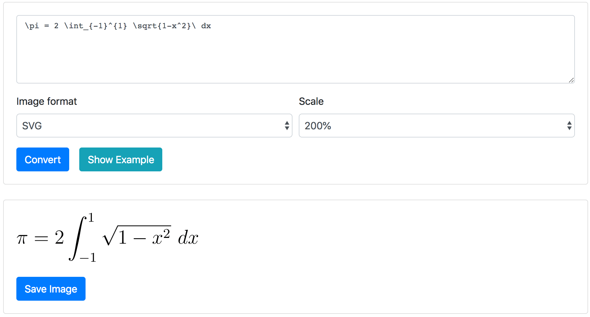

# LaTeX2Image



A Node.js web application that allows LaTeX math equations to be entered and converted to PNG/JPG/SVG images.

For each conversion, an isolated Docker container with a LaTeX installation is started; it compiles the generated `.tex` file and converts it to an SVG vector image. If required, the SVG file is then converted to a raster image format for PNG/JPG.

Bootstrap and jQuery are used in the web interface, with AJAX calls made to the conversion API endpoint.

## Live Demo

The application is accessible at [https://latex2image.joeraut.com](https://latex2image.joeraut.com)

## Requirements

### Operating system

I made use of Ubuntu 18.04. Other Linux distributions should work without problems.

### Docker

[Docker CE](https://docs.docker.com/install/linux/docker-ce/ubuntu/) with [non-root user support](https://docs.docker.com/install/linux/linux-postinstall/#manage-docker-as-a-non-root-user).

### [latex-docker](https://github.com/blang/latex-docker)

Docker image containing the required LaTeX packages preinstalled.

Pull the image:

```
docker pull blang/latex:ubuntu
```

### Node.js

I made use of v10.14.2, anything newer should be fine.

After cloning or downloading this project, run the following to install local dependencies from npm:

```
cd latex2image-web/
npm install
```

### (Optional) Global Node.js packages for non-SVG image export

SVG files can be generated as-is, but for PNG and JPG export support, the two global Node.js packages [svgexport](https://www.npmjs.com/package/svgexport) and [imagemin-cli](https://www.npmjs.com/package/imagemin-cli) are required:

```
npm install svgexport -g
npm install imagemin-cli -g
```

## Usage

To run:

```
node app.js
```

The web interface will be accessible at `http://localhost:3001` by default. The port and HTTP URL can be modified inside `app.js`.

Enter a LaTeX equation, for example `\frac{a}{b}`, and press Convert. The result will be displayed below the button.

## Security

LaTeX is powerful, with the reading and writing of external files and execution of terminal commands possible. It was decided that a new isolated Docker container be launched for every conversion.

The container is only able to access the local `temp/<id>/` directory and has no network access.

Additionally, the compilation process will be killed after 5 seconds if not complete; this is to safeguard against infinite loops and other troublesome LaTeX quirks.

## Internals

Commands used:

* `latex` - Converts `.tex` source file to `.dvi` intermediate
* `dvisvgm` - Converts `.dvi` file to `.svg` vector image
* `svgexport` - Converts `.svg` to `.png` or `.jpg` raster images
* `imagemin` - Compresses `.png` and `.jpg` images

## Notes

* The directories `temp/` and `output/` will be generated automatically inside the `latex2image-web/` directory upon first launch.
* `temp/` stores temporary `.tex`, `.dvi`, and `.svg` files during compilation in an inner `temp/<id>/` directory, which is deleted upon completion of the conversion.
* Final output images are stored in `output/`, and are never deleted.

## Authors

* Joseph Rautenbach - [joeraut](https://github.com/joeraut)

## Issues

For any issues or bugs, please submit an issue or pull request.

## License

This project is licensed under the MIT License - see the [LICENSE](LICENSE) file for details.
